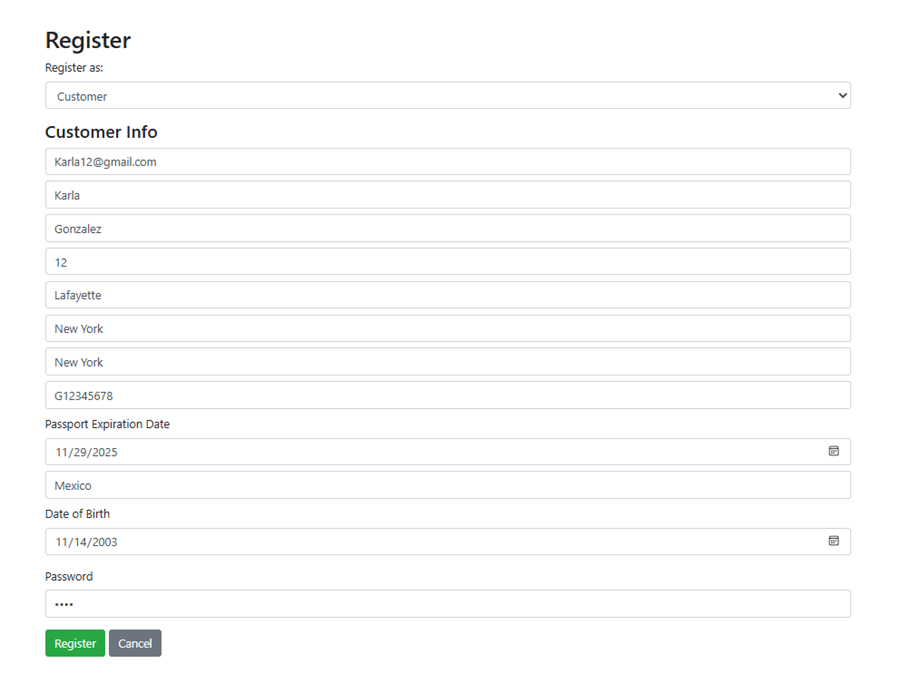
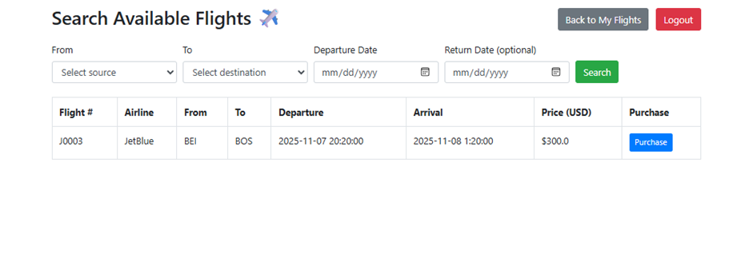
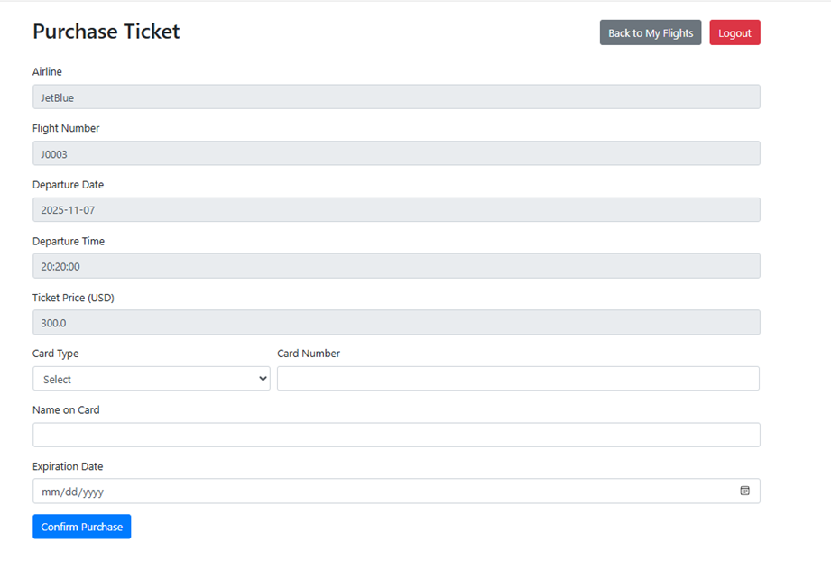
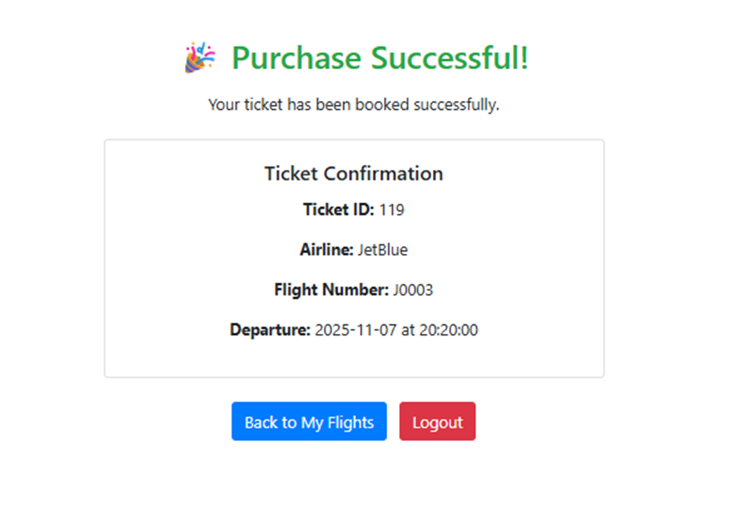
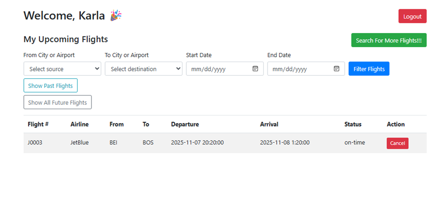
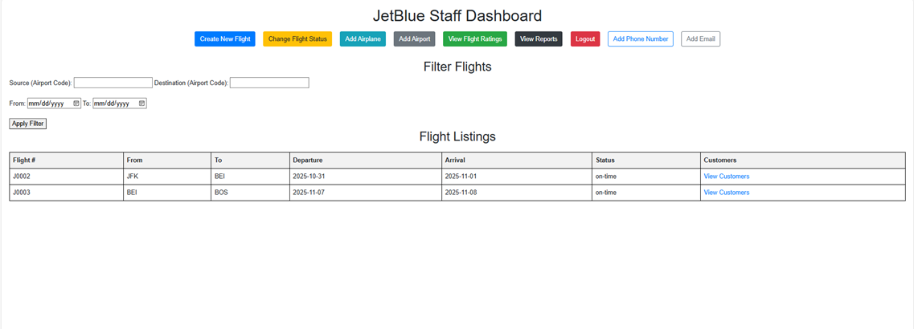
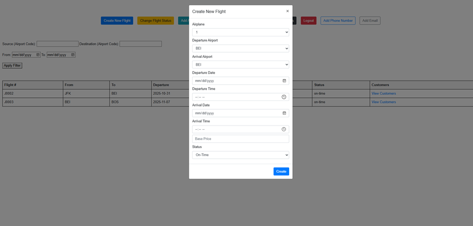
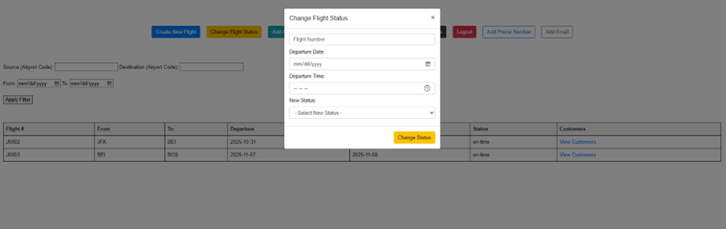
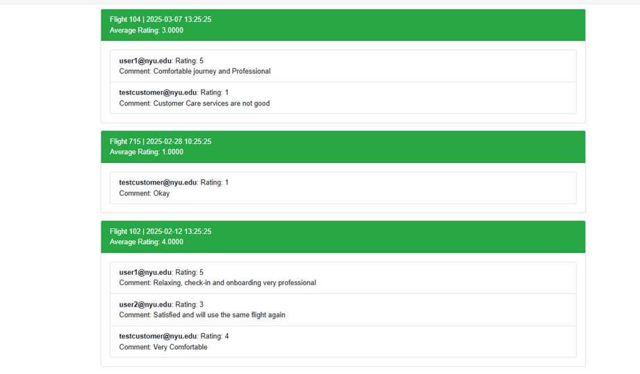
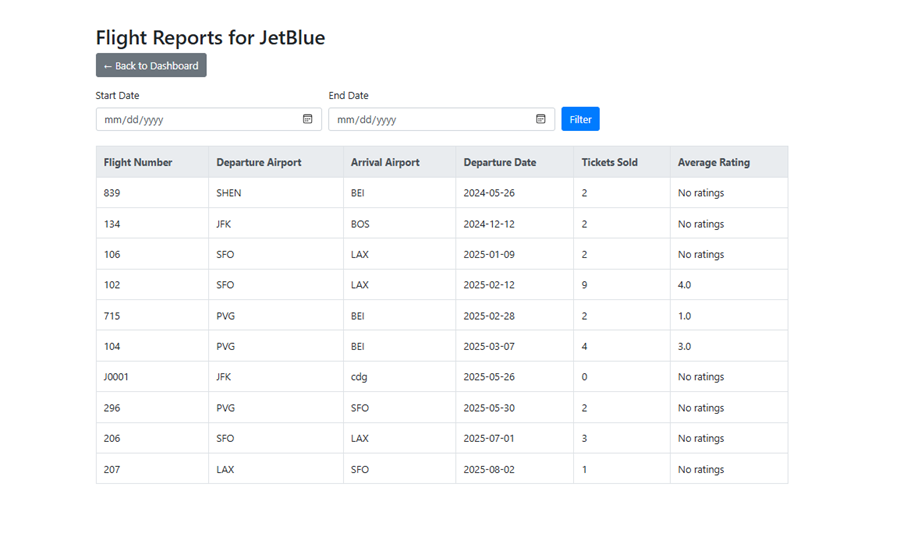

# Air Ticket Reservation System
 
This project implements a **web-based air ticket reservation system** with two types of users:  
- **Customers** (search flights, buy tickets, manage trips)  
- **Airline Staff** (manage flights, airplanes, and airports).  

The system is built with **PHP (XAMPP stack)** and **MySQL** (phpMyAdmin).  

---
### Requirements
- Install [XAMPP](https://www.apachefriends.org/) (Apache + MySQL).
- Enable both **Apache** and **MySQL** services from the XAMPP Control Panel.
- Clone/download this project folder.

### Database Setup
1. Open **phpMyAdmin** at [http://localhost/phpmyadmin](http://localhost/phpmyadmin).
2. Create a new database (e.g., `air_ticket_system`).
3. Import the tables by running the script: createtables.sql. This sets up all necessary tables and initial data.

## Project Structure
Main_Project_Folder/
|── FINAL_RUNNING_VERSION_OFFICIAL/
    │── myenv/ # (ignored, Python environment - not needed for PHP)
    │── templates/ # HTML/PHP templates for pages
    │── init1.py # (testing script, not required for PHP)
│── createtables.sql # SQL file to create all database tables
│── .gitignore
│── README.md
│── requirements.txt

---

## Website Features

Below are the main parts of the system with short explanations.  
📸 Please insert screenshots of each page after you run the project.

### Home Page (Public Access)
- Users can **search for flights** by source/destination city, airport, and date.
- Shows **flight status** (on-time, delayed, canceled).
- Links to **login** and **registration** pages.  
*Screenshot: `docs/screenshots/home.png`*

---

### Customer Features
- **Register/Login**: Customers sign up with personal and passport info.  

- **Search for Flights**: One-way or round-trip searches with filters. 
 
- **Purchase Tickets**: Buy tickets if seats are available.  

- **View My Flights**: List of purchased flights (future & past). 
 
- **Cancel Trip**: Cancel future trips (>24 hours before departure).  
- **Rate & Comment**: Give feedback on completed flights.  
- **Logout**: End the session.  
---

### Airline Staff Features
- **View Flights**: See flights for the airline they work for.  

- **Create Flights**: Add new flights with airplane & schedule info.
  
- **Change Flight Status**: Update status (on-time, delayed, canceled).  

- **Add Airplanes**: Register new airplanes under the airline.  
- **Add Airports**: Insert new airports into the system.  
- **View Flight Ratings**: See average ratings & customer comments. 
 
- **View Reports**: Ticket sales by date range/month/year. 
 
- **Logout**: End the session.  
---

## Notes
- Make sure **XAMPP is running** before using the system.  
- The database must be initialized with `createtables.sql` before logging in.  
- Sessions are required, so PHP must have sessions enabled.  

## Contributors
- Ameena Zewail
- Renata Espinosa Gonzalez 